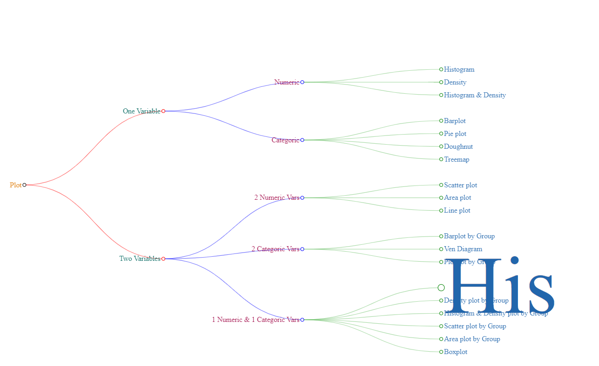

```{r setup, include=FALSE}
knitr::opts_chunk$set(echo = TRUE)
```

## R_networkD3

NetworkD3 in R


#### link to data
[data](data/network3D_diagonalNetwork.csv)

```{r }
library(networkD3)
library(data.tree)


df <- read.csv("data/network3D_diagonalNetwork.csv",stringsAsFactors = FALSE)
head(df)

# using data.tree to create a tree
networkD3 <- data.tree::FromDataFrameNetwork(df)
networkD3

```




